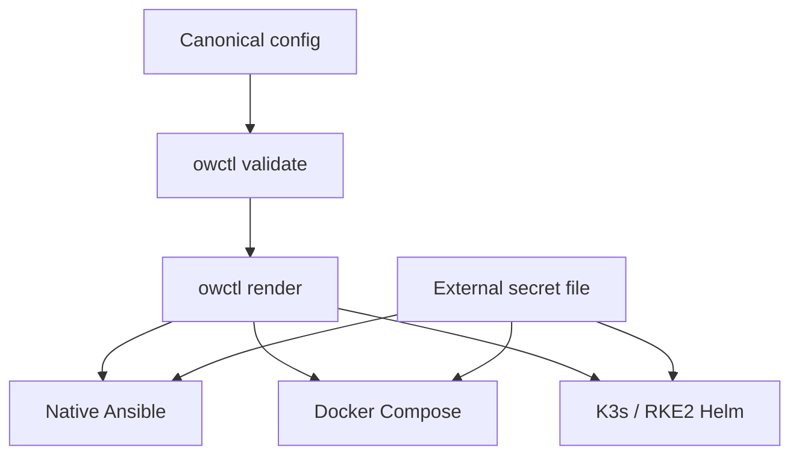
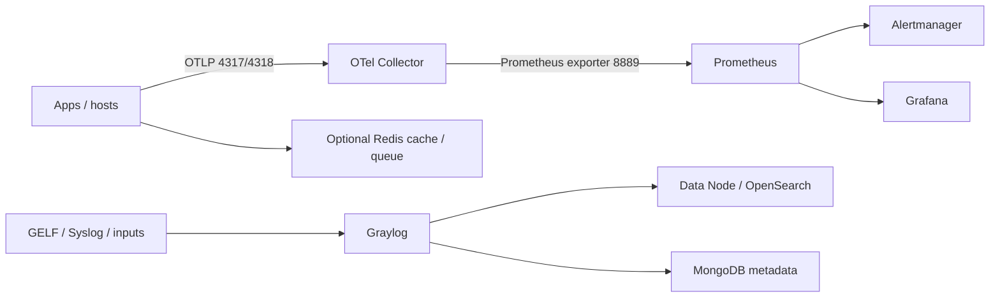

# ObserveWeaver

**One editable configuration for a complete open observability stack—from one
Linux host to a 3+ node K3s/RKE2 or native cluster.**

[](LICENSE)
[](https://github.com/Yunushan/observeweaver/actions/workflows/ci.yml)
[](https://github.com/Yunushan/observeweaver/actions/workflows/security.yml)

ObserveWeaver installs and configures:

- Prometheus
- Alertmanager
- Grafana OSS
- OpenTelemetry Collector Contrib
- Zabbix Server, web interface, and PostgreSQL integration (raw Linux, Docker,
  and K3s/RKE2)
- Graylog Open
- OpenSearch
- Redis Community Edition (optional cache, queue, and ephemeral state service)

It also manages the dependencies the requested stack cannot work without:
MongoDB for Graylog, Redis for optional application state, and an external
PostgreSQL connection for active-active Grafana.

## Why this repository exists

The individual products are excellent, but their installation models,
configuration formats, version rules, and HA semantics differ. ObserveWeaver
puts the operator-controlled choices—nodes, IPs, DNS names, ports, TLS,
storage, retention, versions, and replicas—in one YAML file. `owctl` validates
cross-component rules and renders deployment-specific files without copying
secrets into them.

Kubernetes storage sizes become PVC requests. Raw and Docker deployments use
host filesystem capacity, so their quotas and volume sizing remain external
storage-administration tasks.



## Support at a glance

| Target | Standalone | 3+ nodes | Full central stack | Status |
|---|---:|---:|---:|---|
| Ubuntu 22.04/24.04/26.04 native | Yes | Yes | Yes | Supported |
| Rocky/Alma/RHEL 9/10 native | Yes | Yes | Yes | Supported |
| Rocky/Alma/RHEL 8 containers | Yes | Yes | Yes | Raw unsupported; containers supported |
| Linux Docker Compose | Yes | Multi-host beta | Yes | Supported / beta |
| K3s on Linux | Yes | Yes | Yes | Supported; Graylog chart beta |
| RKE2 on Linux | Yes | Yes | Yes | Supported; Graylog chart beta |
| Windows 10/11 native | Selected components | No | No | Component/agent support |
| Windows Server native | Selected components | No | No | Component/agent support |
| Windows with Linux VM/WSL2 | Yes | Remote Linux cluster | Yes | Supported execution layer |

Graylog Server does not have a native Windows package, K3s server nodes are
Linux-only, and RKE2 server/control-plane nodes are Linux-only. ObserveWeaver
rejects configurations that claim otherwise. See [the complete support
matrix](docs/support-matrix.md).

## Tested pinset

| Component | Version | Important rule |
|---|---:|---|
| Prometheus | 3.13.1 | Replicas have independent TSDBs |
| Alertmanager | 0.33.1 | Prometheus targets every peer directly |
| Grafana OSS | 13.1.1 | 2+ replicas require shared PostgreSQL/MySQL |
| OTel Collector Contrib | 0.157.0 | No durable trace backend is bundled |
| Zabbix Server | 7.0.28 LTS | Raw Linux, Docker, and K3s/RKE2; clustered HA requires external PostgreSQL |
| Graylog | 7.1.6 | No rolling upgrade |
| OpenSearch for Graylog | 2.19.5 | 2.19.6 and 3.x are rejected |
| MongoDB | 8.0.28 | Required Graylog dependency |
| Redis Community Edition | 8.8.0 | Password-protected, AOF persistence; three-member Sentinel profile in cluster mode |

The machine-readable locks are in [`versions/`](versions/). Graylog's current
[compatibility matrix](https://go2docs.graylog.org/current/downloading_and_installing_graylog/compatibility_matrix.htm)
is the governing constraint, not the latest OpenSearch release.

## Quick start: Docker on one Linux host

Requirements: Python 3.10+, Docker Engine, and Docker Compose v2.
OpenSearch also requires `vm.max_map_count=262144`.

```bash
git clone https://github.com/Yunushan/observeweaver.git
cd observeweaver
python3 -m venv .venv
. .venv/bin/activate
python -m pip install -e .

cp config/examples/standalone.yml config/production.yml
# Edit config/production.yml: IP, domain, ports, storage, retention, and TLS.

CONFIG_FILE=config/production.yml scripts/observeweaver.sh validate
CONFIG_FILE=config/production.yml scripts/observeweaver.sh secrets
CONFIG_FILE=config/production.yml scripts/observeweaver.sh render
CONFIG_FILE=config/production.yml scripts/observeweaver.sh deploy --yes
CONFIG_FILE=config/production.yml scripts/observeweaver.sh verify
```

The example binds admin ports to a configurable address. Put Grafana, Graylog,
and Zabbix behind a TLS reverse proxy; never expose MongoDB, OpenSearch, or
Redis directly. The Compose backend network is internal and those database
ports are not published. Raw/Docker `tls.mode: provided` records the full-chain
certificate and private-key paths consumed by that external proxy. On K3s/RKE2,
the installer imports those files into a Kubernetes TLS Secret without writing
the key into generated files or containers.

## Quick start: 3-node RKE2

The application installer expects an existing healthy cluster. Use a replicated
production StorageClass—not K3s `local-path`—when node-loss availability
matters.

```bash
cp config/examples/cluster.yml config/production-ha.yml
# Replace the documentation addresses, domain, VIP, StorageClass, and sizes.

CONFIG_FILE=config/production-ha.yml scripts/observeweaver.sh validate
CONFIG_FILE=config/production-ha.yml scripts/observeweaver.sh secrets

# For Grafana and Zabbix HA, edit secrets/observeweaver.env and set:
# GRAFANA_DATABASE_HOST, GRAFANA_DATABASE_NAME, and GRAFANA_DATABASE_USER.
# ZABBIX_DATABASE_HOST, ZABBIX_DATABASE_PORT, ZABBIX_DATABASE_USER,
# ZABBIX_DATABASE_PASSWORD, and ZABBIX_DATABASE_NAME.

CONFIG_FILE=config/production-ha.yml scripts/observeweaver.sh render
CONFIG_FILE=config/production-ha.yml scripts/observeweaver.sh deploy --yes
NAMESPACE=observeweaver deployments/kubernetes/verify.sh
```

On Kubernetes, the official Graylog chart deploys Graylog Data Node, which
manages the OpenSearch backend. This is safer than independently upgrading an
external OpenSearch chart.

## Configuration contract

The canonical YAML is the only ordinary file an operator edits:

```yaml
deployment:
  engine: rke2       # raw | docker | k3s | rke2
  mode: cluster      # standalone | cluster

nodes:
  - name: obs-01
    address: 192.0.2.11
    roles: [control, metrics, telemetry, logs, data, ingress]

network:
  domain: observability.example.com
  vip: 192.0.2.10
  ports:
    grafana: 3000
    graylogHttp: 9000
    redis: 6379
    otlpGrpc: 4317

tls:
  mode: cert-manager
  secretName: observeweaver-public-tls
  additionalDnsNames: []       # Add '*.observability.example.com' with a DNS-01 issuer.
  additionalIpAddresses: []    # Only when the issuer and ingress support IP SANs.

storage:
  className: longhorn

components:
  opensearch:
    version: "2.19.5"
    replicas: 3
  redis:
    version: "8.8.0"
    replicas: 3       # Sentinel HA profile in cluster mode
```

The JSON Schema provides editor completion. Semantic validation additionally
rejects bad quorum, incompatible versions, native Windows Graylog, K3s/RKE2
Windows servers, unpinned tags, insecure production TLS, missing Grafana HA
database configuration, and unsuitable cluster storage settings.

See [configuration reference](docs/configuration.md).

## Deployment models

- **Standalone:** one host, local volumes, Grafana SQLite, no availability
  claims.
- **Compact HA:** three Linux nodes share control, metrics, log, and data
  roles. It survives one-node loss when storage, ingress, MongoDB, and
  OpenSearch are configured correctly, but OpenSearch competes heavily for I/O.
- **Split HA:** three control-plane nodes plus at least three dedicated
  worker/data nodes, external HA PostgreSQL, replicated block storage, separate
  ingress/control VIPs, and snapshot-capable object storage. This is the
  production recommendation.

Read [production HA](docs/production-ha.md) before placing all services on the
same three nodes.

## Telemetry flow



Metrics are durable in Prometheus. Logs become durable after a Graylog input is
created and traffic reaches Graylog. Traces currently use the Collector debug
exporter because the requested product list contains no durable trace backend.
The default Collector also sends OTLP logs to its debug exporter; send logs
through a configured Graylog input or add an explicit Collector-to-Graylog
pipeline before relying on them. Configure an external OTLP backend or add
Tempo/Jaeger before sending production traces.

## Repository layout

```text
config/examples/               Canonical examples
schema/                        JSON Schema
versions/                      Application/chart compatibility locks
src/observeweaver/             Validation, rendering, and secret generation
deployments/docker/            Standalone Compose stack
deployments/raw/ansible/       Native Linux standalone/cluster roles
deployments/raw/windows/       Supported native Windows subset
deployments/kubernetes/        K3s/RKE2 Helm deployment
docs/                          Architecture and operating guides
tests/                         Deterministic configuration tests
.github/workflows/             CI and security checks
```

## Security defaults

- No real credential is committed.
- `owctl secrets` writes a gitignored mode-0600 file and refuses overwrite.
- Rendered files contain references, not secret values.
- Images, product versions, charts, downloaded binaries, and GitHub Actions are
  pinned; native x86_64 downloads with published hashes are verified.
- OpenSearch, MongoDB, and Redis are not publicly published in Compose.
- Kubernetes chart archives are checksum-verified before Helm receives them.
- `latest` tags and production plaintext mode fail validation.

The Docker standalone backend is isolated but intentionally optimized for a
reliable first deployment. For zero-trust east-west transport, supply a managed
CA and enable service-to-service TLS according to
[the hardening guide](docs/security.md).

## Commands

```bash
make test
make validate CONFIG=config/examples/cluster.yml
make render CONFIG=config/examples/cluster.yml
make secrets

scripts/observeweaver.sh validate
scripts/observeweaver.sh render
scripts/observeweaver.sh secrets
scripts/observeweaver.sh deploy --yes
scripts/observeweaver.sh verify
```

Generated output belongs under `build/` and must not be hand-edited.

## Project boundaries

- Prometheus replicas alone do not provide merged queries or deduplication.
  Add Thanos/Mimir when this is required.
- The stack does not bundle a durable tracing datastore.
- Docker Compose is a single-host orchestrator. Multi-host Compose can be
  rendered by Ansible but is marked beta; K3s/RKE2 is the preferred clustered
  path.
- ObserveWeaver installs applications onto an existing K3s/RKE2 cluster; it
  does not silently create or reconfigure the cluster itself.
- Native and multi-host Docker deployments expect an external reverse
  proxy/load balancer to own the configured VIP and terminate provided TLS.
- 0BSD covers this repository's original code only. Every installed product,
  chart, image, dashboard, and binary retains its upstream license.

## Documentation

- [Architecture](docs/architecture.md)
- [Configuration](docs/configuration.md)
- [Support matrix](docs/support-matrix.md)
- [Production HA](docs/production-ha.md)
- [Security](docs/security.md)
- [Operations and upgrades](docs/operations.md)
- [Troubleshooting](docs/troubleshooting.md)
- [Windows](deployments/raw/windows/README.md)
- [K3s/RKE2](deployments/kubernetes/README.md)

## License

ObserveWeaver's repository-owned code and documentation are released under the
[Zero-Clause BSD license](LICENSE). See [third-party notices](THIRD_PARTY_NOTICES.md)
for upstream ownership and licensing.
